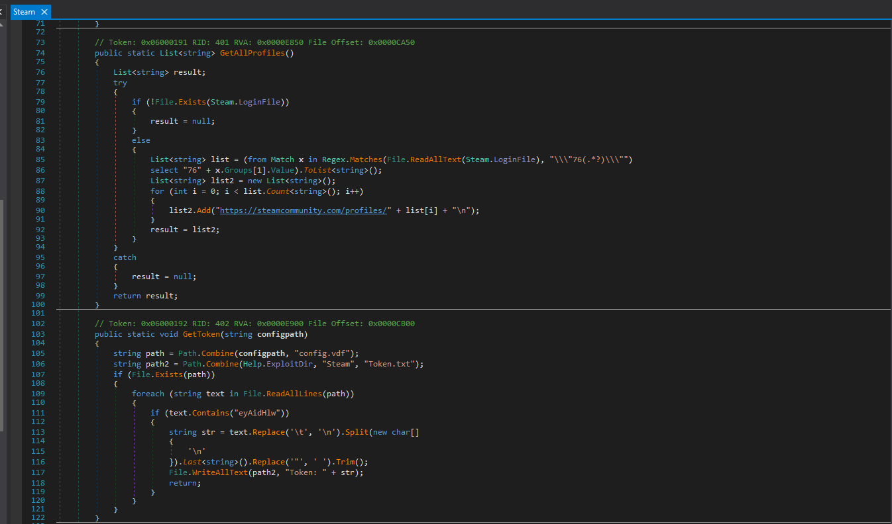
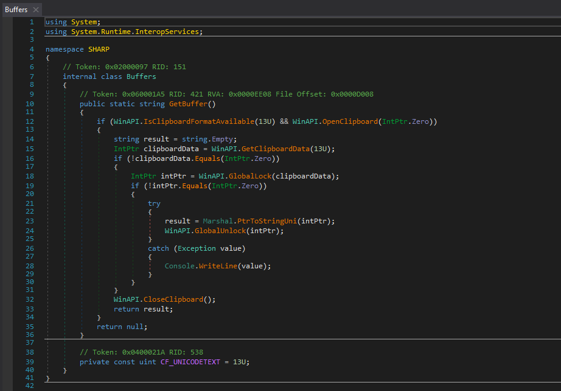
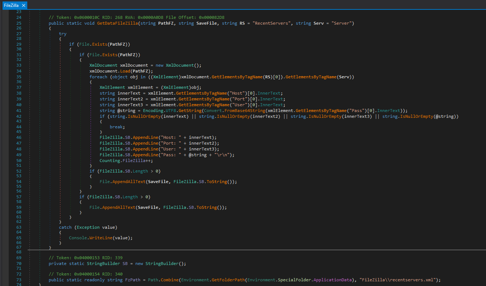

- Introduction
- Metadata
- Overview
- Analysis
- Final Words

## Introduction

Infostealers are a type of malware designed to secretly collect sensitive data such as passwords, browser data, financial information, or crypto keys from infected devices.

In modern times, infostealers pose a major threat because they enable large-scale identity theft, financial fraud, and credential leaks. For everyday users, this means stolen bank logins, compromised social media accounts, and drained crypto wallets. For corporations, it leads to massive data breaches, loss of intellectual property, ransomware attacks, and unauthorized access to internal systems making infostealers one of the most common entry point for larger cyberattacks.

## Metadata

**SHA256:** `d1ea7576611623c6a4ad1990ffed562e8981a3aa209717065eddc5be37a76132`

**Sample Link:** [here](https://bazaar.abuse.ch/sample/d1ea7576611623c6a4ad1990ffed562e8981a3aa209717065eddc5be37a76132/)

## Overview

This infostealer is known as Gremlin Stealer made in C#, it first surfaced in early 2025 on telegram, which the developer was using for selling this malware. They also offered a web interface to manage the stolen data. The stealer would gather credentials from the affected computer and exfiltrate it to the remote server which can be accessed by the admin.

## Analysis
### Determining the file type

Running the file command on the malware we find out that it's a .NET binary.

### Analysis using PE Studio

>[PE Studio](https://www.winitor.com/download) is a static analysis tool for Windows executables, primarily used in malware analysis, reverse engineering, and software inspection.

Looking at the file properties of the stealer in PE studio.

We can also see the detection score on virus total in the results.

We checked the libraries this malware is importing. We see it uses generic bcrypt.dll library for cryptographic operations, user32.dll for user based operations and iphlpapi.dll for networking.

Next, looking at the strings we see indication of the capabilities of this infostealer, what type of info it steals and the remote server it exfiltrates the stolen credentials to.

### Analysis using dnSpy

>[dnSpy](https://dnspy.org/) is a .NET debugger and decompiler — a powerful open-source tool used to inspect, debug, and modify .NET assemblies (like .dll and .exe files built on the .NET Framework or .NET Core).

As we already know by running the file command, this malware is written in C# so we will be using dnSpy to analyze it further.

Upon expanding the Sharp we find a big list of all functions within the malware. These include the functions for various types of data the malware targets and aims to steal such as location info, ftp credentials, credit card information, vpn credentials, crypto wallets, discord, steam account credentials and clipboard contents, etc.

>Doing some further research we also find that the “SHARP” name is associated to another stealer which was discovered in 2024 and similar to the gremlin stealer it was being advertised and sold on telegram under the name “Sharp Project” and “Sharp Stealer”. It seems like gremlin is an improved version of the sharp stealer.

Looking through the functions we find there are several functions for the various tasks the malware performs, tasks such as encryption, decryption, data exfiltration, reading the contents of the clipboard. All these functionalities utilize libraries that we saw in the previous section. `bcrypt.dll` for cryptographic functions, `user32.dll` for getting clipboard data and `iphlpapi.dll` for networking.

>Iphlpapi.dll is a dynamic link library file in Windows that provides various network-related functions and services, such as managing IP addresses and performing network diagnostics.

We find the “config” function that contains the configurations of the malware. It contains list of types of crypto currency to fetch from the target users crypto wallet, clipboard check delay time, directories to scan for data and much more. We also find the address of the web server where the stolen data is exfiltrated to 

#### Analyzing the core functions

##### **Crypto Wallets**

This malware has a separate functions for various cryptocurrency and crypto wallets. Here is a list of all the crypto wallets supported by this stealer.

We will not be looking at each and every one of them as working of each cryptostealer function in this malware is similar i.e. to check the registry key for the wallet and then find the dat file of the wallet which contains the private keys, copies them to the malware controlled directory. Here we will take a look at the function for Litecoin stealer.

This whole function is wrapped in try-catch block which allows it to swallow up failed attempts silently. The function first attempts to access the subkey `HKCU\Software\Litecoin\Litecoin-Qt`. It then copies the `wallet.dat` file from it's original path to the malware controlled path to be processed further for exfiltration.

##### **VPN Services**

This malware also supports various VPNs and it fetches their credentials and exfiltrates it. Here is a list of all the VPNs supported by this stealer.

Here we will analyze one of the function for protonvpn.

It fetches the `user.config` file in the protonvpn installation directory and copies it to the malware controlled directory for further processing.

##### **Browsers**

It is very common for infostealers to fetch for saved passwords and cookies from various browsers installed on the system and save them into a file to be exfiltrated later. Here we will take a look at the function responsible for fetching passwords and cookies from Chromium and Gecko based browsers.

Within the PathsCV20 we find function we find a list of browsers that the malware supports along with their default path where the malware fetches them.

>This malware also employs a common technique used by modern infostealers for bypassing the Chrome browsers cookie v20 protection.

##### **Steam, Discord & Telegram**

The **discord** function looks for token in browser sessions.

The **steam** stealer function first determines the install location, then enumerates user accounts on the target system, finds the token within `config.vdf` file and extract that, write it to a file and finally copies the login.vdf file to the malware controlled directory.

This malware can also steal data from **telegram’s** active session.

##### **Clipboard Data**

The malware continuously scans the clipboard for contents and sends them over to the web server.

##### **System Information**

This malware also steals all the system information. The following function shows us what system information is gathered.

This stealer also has the ability to take screenshot.

##### **FTP Credentials**

FTP applications such as Total Commander and File Zilla are also supported by this stealer. It gathers data such as Hostname, Port Number, Username and Password and send it to the web server.

##### **Credit Card Information**

The malware fetches credit card information such as Name, Number, Expiry Year/Month from browsers.

##### **Data Exfiltration**

Gremlin stages all gathered data, archived into a zip file in a malware controlled directory and then exfiltrated either to the web server at `207[.]244[.]199[.]46` and sends a message via telegram.

## Final Words

This was my very basic analysis of the gremlin infostealer. Static analysis of **Gremlin Stealer** (C#) shows a modular infostealer that harvests browser creds/cookies, crypto wallets, VPN/FTP creds, Discord/Steam/Telegram tokens, clipboard data, screenshots and system info, then stages and exfiltrates to a remote server with Telegram reporting. Further steps would be to — run dynamic analysis (sandbox + network capture, process tracing) to confirm runtime behavior; mitigate with endpoint detection, browser hardening, and credential rotation.

