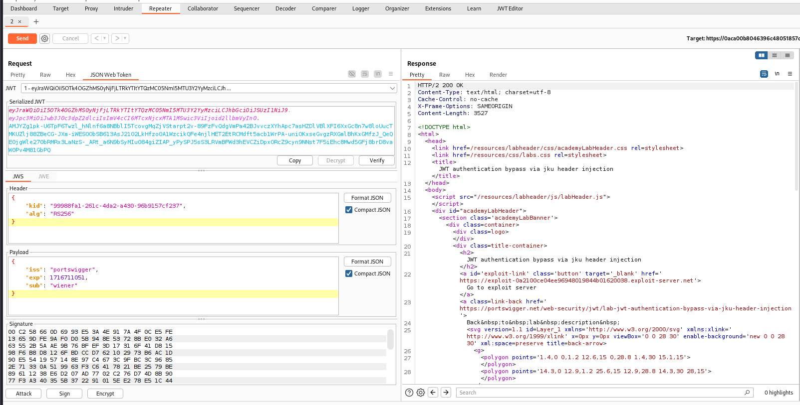
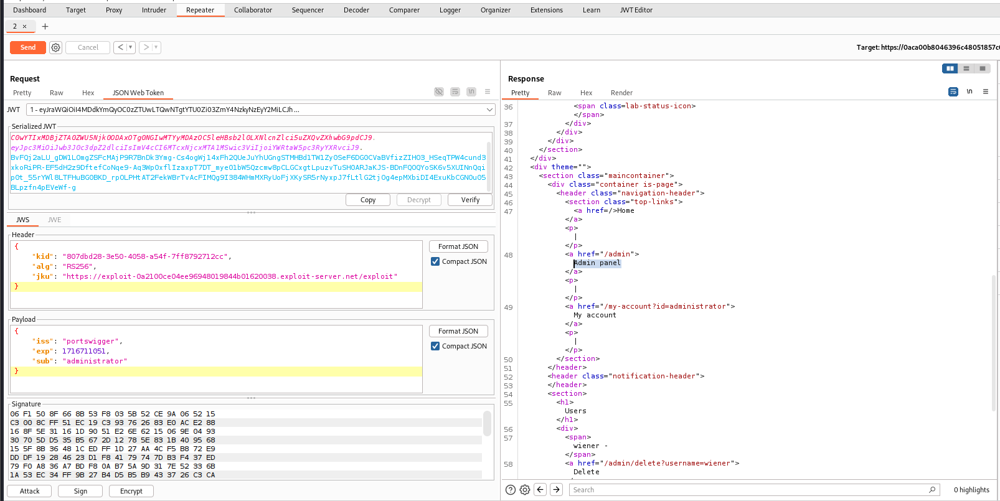

JSON Web Tokens (JWTs) represent a standardized framework for the secure transmission of cryptographically signed JSON data between systems. While JWTs have the capacity to encapsulate diverse types of data, their predominant application lies in conveying user-related information, or "claims," which facilitate authentication, session management, and access control mechanisms.

In contrast to traditional session tokens, JWTs encapsulate all requisite data on the client side within the token itself. This architectural advantage renders JWTs especially advantageous for highly distributed web platforms, enabling seamless user interactions across multiple back-end servers.

A JWT consists of 3 parts: a header, a payload, and a signature. These are each separated by a dot.

```xxxxx.yyyyy.zzzzz```

### Header

The header typically consists of two parts: the type of the token, which is JWT, and the signing algorithm being used, such as HMAC SHA256 or RSA.

For example:

```json
{
  "alg": "HS256",
  "typ": "JWT"
}
```

Then, this JSON is Base64Url encoded to form the first part of the JWT.

### Payload

The second part of the token is the payload, which contains the claims. Claims are statements about an entity (typically, the user) and additional data. There are three types of claims: registered, public, and private claims.

An example payload could be:

```json
{
  "sub": "8261290123",
  "name": "Kiko",
  "admin": true
}
```

The payload is then Base64Url encoded to form the second part of the JSON Web Token.

### Signature

To create the signature part you have to take the encoded header, the encoded payload, a secret, the algorithm specified in the header, and sign that.

For example if you want to use the HMAC SHA256 algorithm, the signature will be created in the following way:
```
HMACSHA256(
  base64UrlEncode(header) + "." +
  base64UrlEncode(payload),
  secret)
```  

The signature is used to verify the message wasn't changed along the way, and, in the case of tokens signed with a private key, it can also verify that the sender of the JWT is who it says it is.

## Public and Private keys

Public and Private keys play a crucial role in ensuring the security and integrity of the data transmitted between systems. This mechanism typically involves asymmetric cryptography, where a pair of keys—one public and one private—are used.

The private key is used to sign the JWT, creating a unique signature that verifies the authenticity of the token and ensures that the data has not been tampered with. This private key is kept secret and is only known to the issuer of the token.

The corresponding public key is then distributed to any systems or services that need to verify the JWT. When a JWT is received, the recipient uses the public key to validate the signature. If the signature is valid, it confirms that the token was indeed signed by the holder of the private key and that its contents are trustworthy.

## JWT header parameter injections

According to the JWS specification, only the `alg` header parameter is mandatory. However, in practical applications, JWT headers (also known as JOSE headers) typically include several additional parameters. The following parameters are particularly noteworthy for attackers:

- `jwk` (JSON Web Key) - Contains an embedded JSON object that represents the key.

- `jku` (JSON Web Key Set URL) - Specifies a URL from which servers can retrieve a set of keys, including the correct key.

- `kid` (Key ID) - Provides an identifier that servers use to select the appropriate key when multiple keys are available. This identifier may correspond to a matching `kid` parameter in the key.

## Injecting self-signed JWTs via the jku parameter

Instead of directly embedding public keys using the `jwk` header parameter, some servers utilize the `jku` (JWK Set URL) header parameter to reference a JWK Set that encompasses the key. During the signature verification process, the server dynamically fetches the pertinent key from the provided URL, enhancing flexibility and scalability in key management.

JWK Sets are often made publicly accessible through standardized endpoints, such as `/.well-known/jwks.json`.

### Exploitation

Install the jwt editor plugin in burpsuite from the bapp store. This will help us modify the jwt smoothly.
For this example we are using the [JWT authentication bypass via jku header injection](https://portswigger.net/web-security/jwt/lab-jwt-authentication-bypass-via-jku-header-injection) lab from portswigger.

Make sure burp is running, then login into your account with the provided credentials `wiener:peter`

Go to burp > Proxy > HTTP History and send the `GET /my-account` request to burp repeater and switch to the JSON Web Token tab.



If you try to change the path from `/my-account` to `/admin` and then send the request, the application with respond with 401 Unauthorized.

Now head over to the JWT Editor tab on the main menu bar and click on `New RSA Key` and click on generate, then click on OK.
This will generate a pair of RSA Keys that we will use to bypass the authentication.

Now right click on the generated RSA Key in the JWT Editor tab and click on `Copy Public Key as JWK`.
Now head over to the application in the browser and open the exploit server. In the body section, create an empty jwk set like this:

```
{
    "keys": [

    ]
}
```

Now paste the keys you copied from the jwt editor in between the empty jwk set, it should look something like this:

```
{
    "keys": [
        {
            "kty": "RSA",
            "e": "AQAB",
            "kid": "807dbd28-3e50-4058-a54f-7ff8792712cc",
            "n": "s8ciu2j6jc7tM1zIkA5IJt_LK0xRnFfcAfKqtGH6Uoh0I3CWOHsjvZVgZn0LNrFq78h6v4XhnIQB_zc7QdUGFchOppUQNYScVYxkjIOJpbXmI4Tm5-7SI_GNQqJ9MlzZTA6m243QGJyP-01VOOyA6Cy6Dq-fvgetbmizcpzbO0Qtycg7e89FBWkD7RS_-73SCQ11O83EJAXP19fmIUFskyL5nx_cSkMiA4Lo0dya23rCSBWMwSzuMT9ekVWK-kUss-JKypwKE5-DKrqogrsAjAg_VOIs_jRiRNUVRuS3qSk41lii_-ZJVLw0CWVue-eECwsp55XZSWNzdGHXAQtyKw"
        }
    ]
}
```
Click on store to save the keys.

> Note: Here the exploit server is acting as a file hosting service, where we are hosting our public keys, in a real life scenario you will need to use a service to host the file to make it accessible over the internet, such as ngrok.

Now back to burp, switch to the repeater tab and then to the JSON Web Token tab. Here we will have to modify a few headers:

- change the value of the kid header to the value of the kid header we put in the exploit server.

- add jku header and set its value to the url of the exploit server (it can be found on the top of the exploit server page in the application)

- change the value of sub parameter in the payload section from `wiener` to `administrator`

Now we will sign the jwt with the RSA key we generated at the bottom click sign button. A popup will appear, select your RSA key and make sure the `Don't modify header` option is checked and click on OK.

Now we are all set, make sure to check the path is set to /admin and click on Send to send the request.



And we have successfully bypassed the jwt authentication.

> Note: Many secure websites will only fetch keys from trusted domains, but you can sometimes take advantage of URL parsing discrepancies to bypass this kind of filtering. Example: `https://allowed-host@attacker-host`