- Introduction
- Metadata
- Overview
- Static Analysis
- Dynamic Analysis
- Final Words

## Introduction

I recently completed the Practical Malware Analysis & Triage course from TCM Security, Big kudos to Matt Kiely (Husky Hacks) for putting together such an awesome course. So after completing PMAT I was looking out for some malware to analyze and I stumbled upon this LeprechaunHvnc loader. Doing further research I found that it was initially discovered by a researcher [Kseniia N](https://x.com/naumovax) and their teammate [Tony](https://x.com/t0nynot) in April 2024 and they posted about it [here](https://x.com/naumovax/status/1775185431237206209).

#### What is a Loader ?
>A loader is a malware that fetches, decrypts, or loads another payload (often from a remote server) into memory for execution.

#### Difference between a loader and a dropper
>A dropper delivers and installs a built-in payload, while a loader retrieves or loads a payload from elsewhere for execution.

## Metadata

**SHA256:** `1d0753beaabc660960bb5297f43eae38128647c2a23b02b2550646d58aff8797`

Sample Link: [bazaar.abuse.ch](https://bazaar.abuse.ch/sample/1d0753beaabc660960bb5297f43eae38128647c2a23b02b2550646d58aff8797#)

## Overview

In this blog we will be going over the analysis of the leprechaun loader. First we perform static analysis using IDA to understand the working of the loader, then we will use wireshark to see the working of the loader by inspecting the http web traffic it generates when it tries to reach out to the C2 server and finally verify that it creates a registry key (as we will see in the static analysis) using registry editor. And the leprechaun name is taken from an Irish Legendary Creature.

## Static Analysis
### Inspecting in PE Studio

>[PE Studio](https://www.winitor.com/download) is a static analysis tool for Windows executables, primarily used in malware analysis, reverse engineering, and software inspection.

File properties

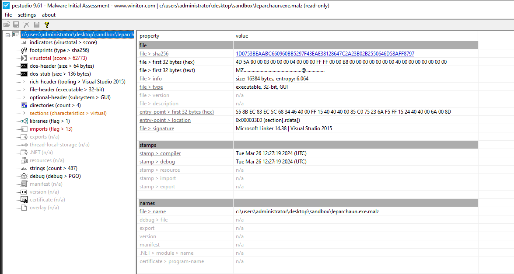

Looking at the strings in PE studio we find some important indicators that this malware is an loader and part of a c2.

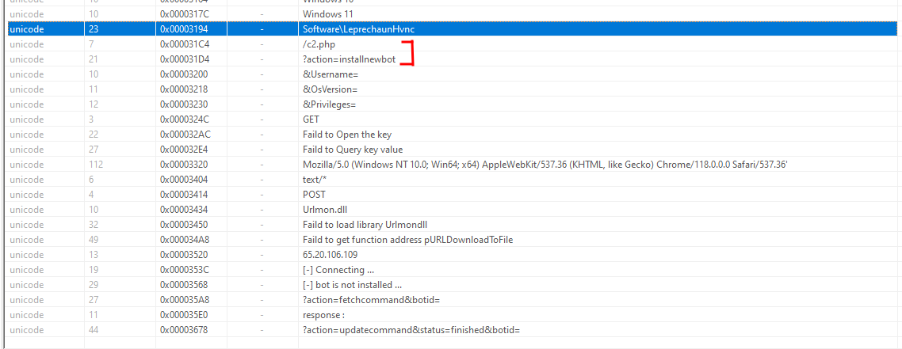

Additionally we look at the libraries being used in the loader. Pretty generic stuff - `WININET` for creating connections between the compromised machine and the c2 server.

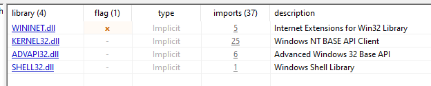

### Analyzing using IDA

>[IDA](https://hex-rays.com/ida-free) (short for Interactive DisAssembler) created by Hex Rays, is one of the most powerful and widely used disassemblers and reverse engineering tools in the cybersecurity and software analysis world.

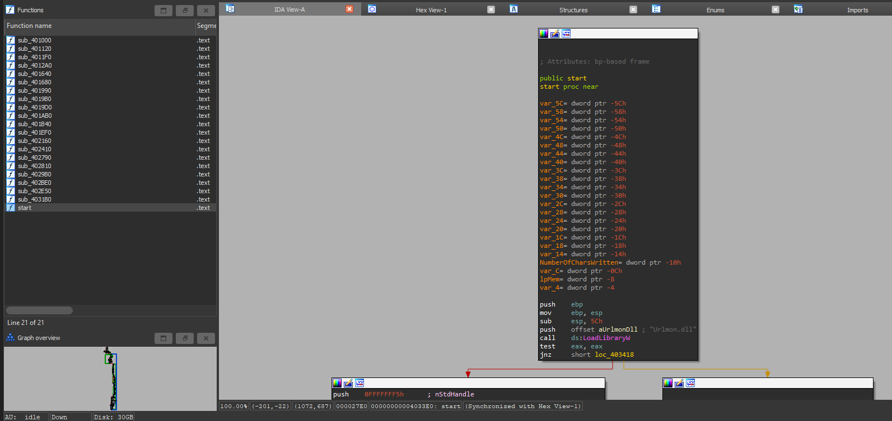

We have a few functions and a huge graph starting from the start function.

Looking through the graph view, initially we find use of Urlmon.dll file, going a little further we find the address of the c2 server being used.

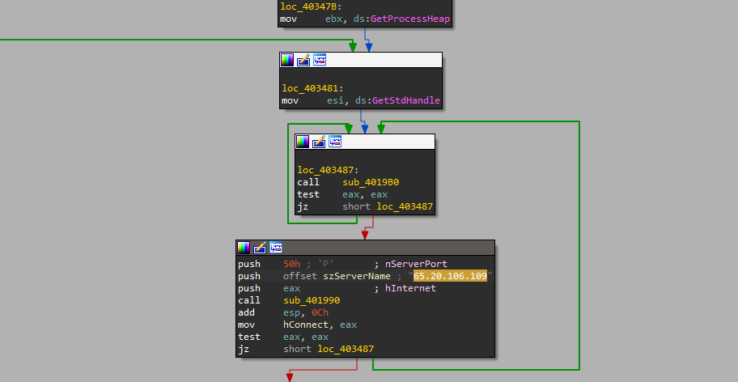

Looking further we find that there are 2 operations being performed depending on the condition whether the implant is installed or not.

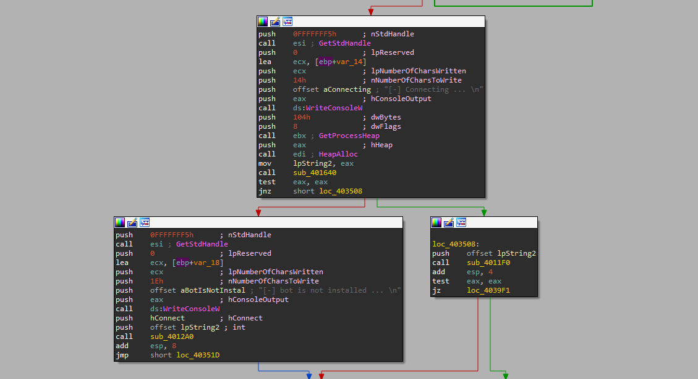

Before that we see a function called `sub_401640` that simply checks whether the subkey `Software\\LeprechaunHvnc` is present in the location `HKEY_CURRENT_USER`, basically it checks if the implant is present on the target.

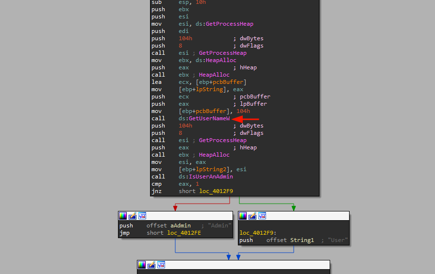

#### Function 1 - `sub_4012A0` 

The first thing we find is, the malware is utilising the `GetUserName` function to check the current user.

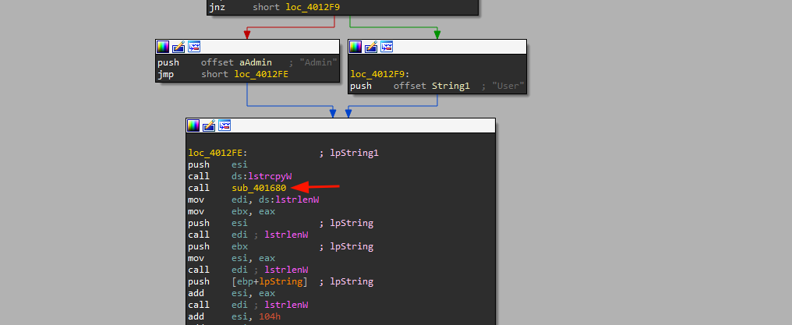

Next we see that another function `sub_401680` is called, opening this function we find that it is being used to determine the os version.

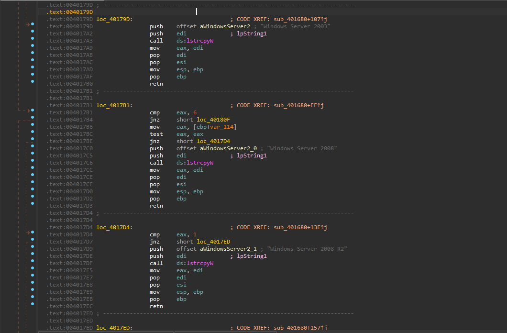

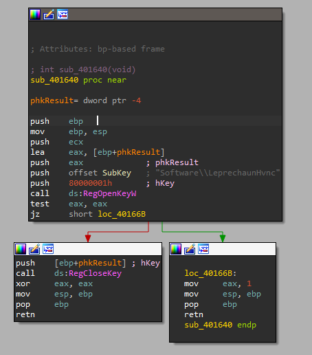

After the user and the windows version are enumerated the string length function is used to store the value of both in variable v6 (for user) and the windows version string length is added to the v6 variable value and stored in v7. And the last v8 variable stores the string length of the value returned from the `GetUserNameW` function we saw initially and adds it us with the value of variable v7 along with some more space.

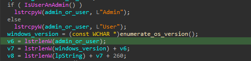

The next part of the function establishes a connection with the c2 and downloads the implant using the HttpOpenRequestW API function and sends a GET request.

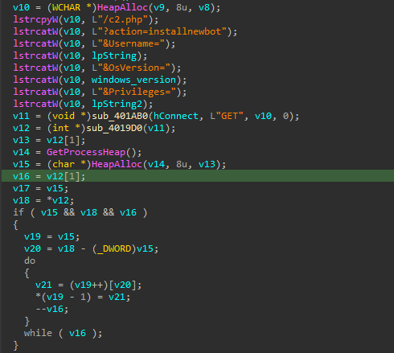

Moving on to the next part of the function, it creates a registry key named `Software\LeprechaunHvnc` and sets value named “ID” in that key.

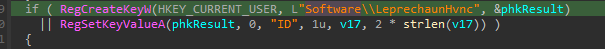

The last part of the current function checks if the value of the lpString2 is "User" (which is determined from the initial checks this function performs). If the value is user, then the loader generates a directory named `WindowsecurityUpdates` under the documents directory and copies the downloaded implant to the created directory within documents directory. It also creates a registry subkey named `windowsupdates`.

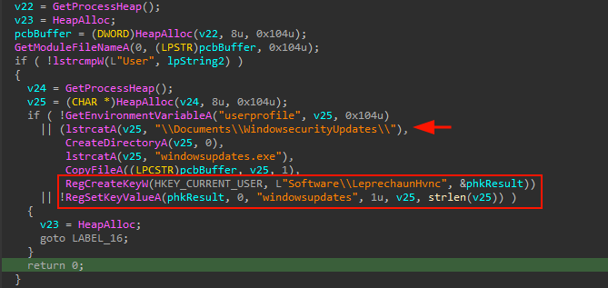

#### Function 2 - `sub_4011F0` 

Now we will take a look at the other function which is called when the registry key for the Leprechaun exists. This function checks if the value **ID** is present inside the registry key `Software\\LeprechaunHvnc`

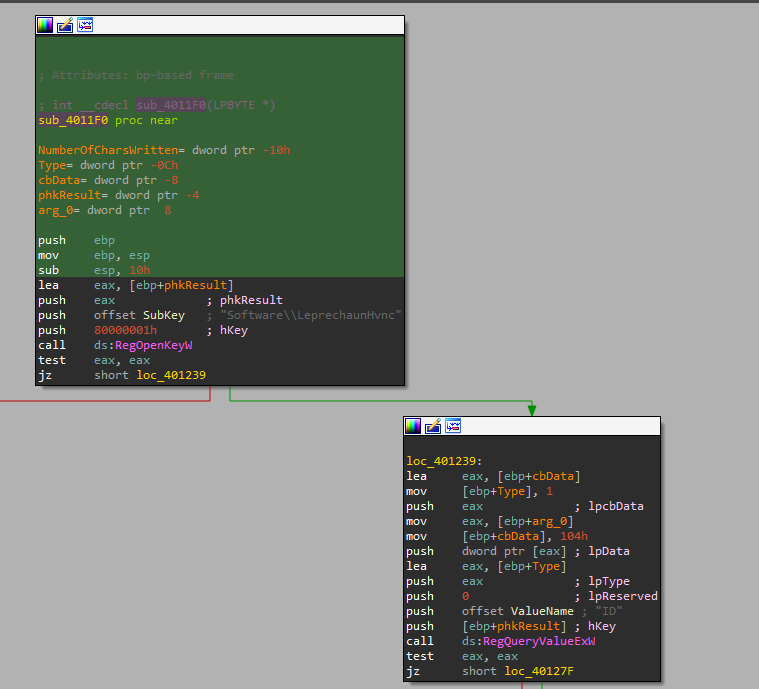

Now moving back to the main (start) function going further from the registry key check functions we find that it is using the Internet API and sending a GET request to the c2 server which is the value stored inside the v11 variable.

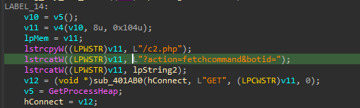

Moving further we find a function `sub_4019D0` being called that downloads something from the c2 server.

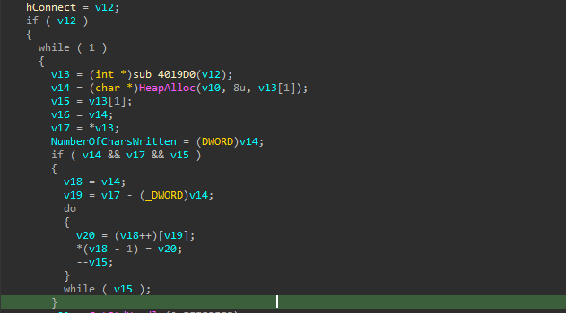

Next we see the functionality of the malware which is responsible for fetching tasks from the c2 operator, replying with task status and performing certain tasks.

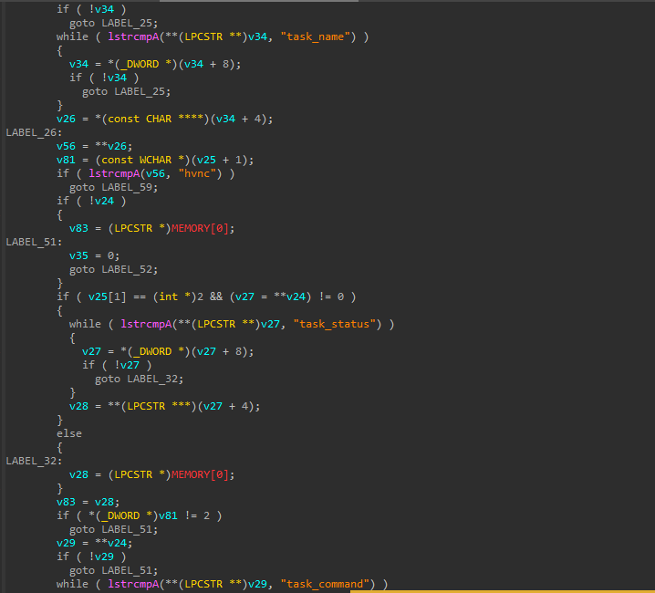

One part of function checks the activity status of the loader, whe it is started or stopped.

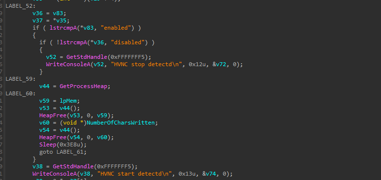

Looking at the last part of the loader we see that it creates a temporary directory called temp and prepares it to download a file from the specified URL and send the confirmation back to the c2 operator.

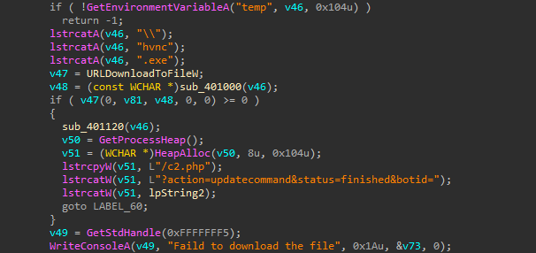

And the work of the loader is finished here after downloading the implant onto the target system.

## Dynamic Analysis

If you are following along, make sure you take snapshot of the VM you are using for the analysis before executing the malware so that it can be restored after the analysis is completed.

### Checking the HTTP traffic using Wireshark

We start up wireshark, make sure its listening on our network card and execute the leprechaun.exe file.

Filtering for http traffic in wireshark we find that the loader tries to send the os version and user details to the c2 operator and then further tries to receive commands but the c2 is shut down, so it keeps trying to reach out to the c2 continuously.

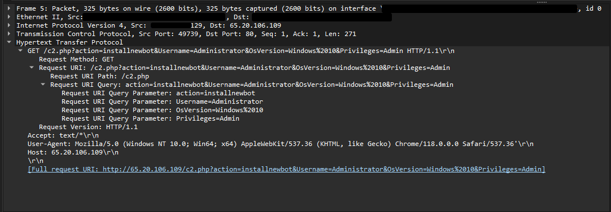

### Checking the registry records

Furthermore we check the registry editor and find that a registry key is created with the name LeprechaunHvnc with a value ID as we saw in our analysis using IDA above.

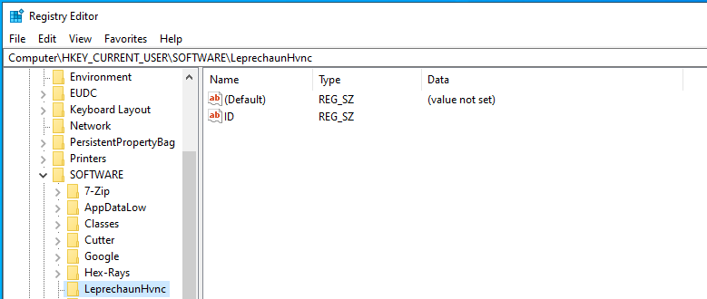

## Final Words
This was my first ever analysis of a malware so I probably would have missed some things but it was a good experience dissecting this loader and looking at the internal workings of how it operates, establishing a foothold on the system, using registry key to verify the presence of the implant, enumerating user privileges and windows version, downloading the implant from the c2 server and performing certain tasks as commanded by the c2 operator. I might release some more malware analysis blogs in future.